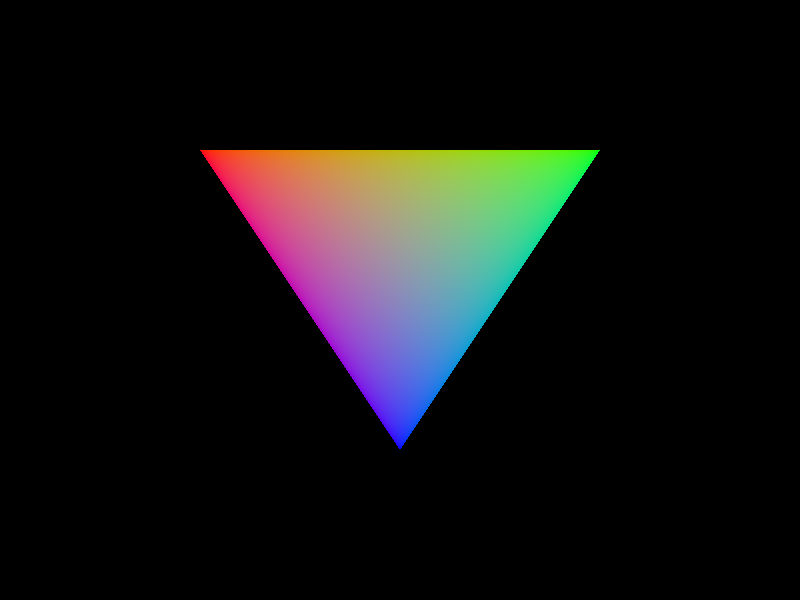

# Vulkano Rainbow Triangle



Classical Rainbow Triangle using Rust and Vulkan via [vulkano](https://github.com/vulkano-rs/vulkano) bindings.

Based on the vulkano [triangle example](https://raw.githubusercontent.com/vulkano-rs/vulkano/v0.22.0/examples/src/bin/triangle.rs)

## Quick Start

```console
$ cargo run
```
